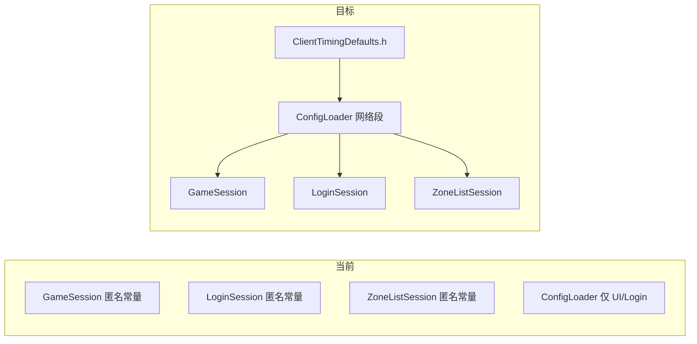

# 配置与错误码规范化

## 现状诊断

| 问题 | 现状 |
|------|------|
| 心跳/超时散落 | [`net/GameSession.cpp`](net/GameSession.cpp)：`kHeartbeatIntervalMs=10000`、`kMoveSendIntervalMs=100`、`kLogoutTimeoutMs=15000`；[`net/LoginSession.cpp`](net/LoginSession.cpp) / [`net/ZoneListSession.cpp`](net/ZoneListSession.cpp)：各有一份 `kConnectTimeoutMs` / `kResponseTimeoutMs` |
| 配置不统一 | 仅 [`util/ConfigLoader`](util/ConfigLoader.h) 管窗口/日志/loginHost；`GameSession` **未**接入配置；[`util/LocalSettings`](util/LocalSettings.h)（用户偏好 JSON）与 [`database/*.lua`](database/)（玩法数据）职责未文档化 |
| 错误码不规范 | wire `code` 以注释魔法数散落在 [`Common/LoginMsg.h`](Common/LoginMsg.h)（如登录 `0/1/-1`）；`CreateCharacterError` **仅注释引用、无枚举**；[`GatewayValidateCode`](Common/LoginCommon.h) 已有枚举；客户端超时/断线等 **硬编码中文字符串** 分散在 Session `fail()` |



---

## 1. 心跳/超时：默认值头文件 + 配置可覆盖

**新增** [`sdk/net/ClientTimingDefaults.h`](sdk/net/ClientTimingDefaults.h)（客户端专用，不进 Common 子模块）：

```cpp
namespace ClientTiming {
constexpr int64_t kConnectTimeoutMs      = 10000;
constexpr int64_t kResponseTimeoutMs     = 15000;  // 区列表可用 10000 特例见下
constexpr int64_t kZoneListResponseMs  = 10000;
constexpr int64_t kHeartbeatIntervalMs = 10000;
constexpr int64_t kMoveSendIntervalMs  = 100;
constexpr int64_t kLogoutTimeoutMs     = 15000;
}
```

**扩展** [`util/ConfigLoader`](util/ConfigLoader.h)（沿用现有扁平 XML 解析，不引入第三方库）新增 getter：

- `connectTimeoutMs()` / `responseTimeoutMs()` / `zoneListResponseTimeoutMs()`
- `heartbeatIntervalMs()` / `moveSendIntervalMs()` / `logoutTimeoutMs()`

`applyDefaults()` 从 `ClientTimingDefaults.h` 赋值；`parseXmlContent` 识别新标签（缺失则用默认）。

**更新** [`config/client_config.xml.example`](config/client_config.xml.example)：

```xml
<connectTimeoutMs>10000</connectTimeoutMs>
<responseTimeoutMs>15000</responseTimeoutMs>
<zoneListResponseTimeoutMs>10000</zoneListResponseTimeoutMs>
<heartbeatIntervalMs>10000</heartbeatIntervalMs>
<moveSendIntervalMs>100</moveSendIntervalMs>
<logoutTimeoutMs>15000</logoutTimeoutMs>
```

**替换散落常量**（删除各 cpp 内匿名 `constexpr`，改读 `m_config`）：

| 文件 | 改动 |
|------|------|
| [`net/GameSession.h/cpp`](net/GameSession.h) | 新增 `setConfig(const ConfigLoader*)`；`update()` 用心跳/移动/离世界超时 |
| [`net/LoginSession.cpp`](net/LoginSession.cpp) | 超时判断改 `m_config->connectTimeoutMs()` 等 |
| [`net/ZoneListSession.cpp`](net/ZoneListSession.cpp) | 区列表响应用 `zoneListResponseTimeoutMs()` |
| [`app/GameApp.cpp`](app/GameApp.cpp) | `m_gameSession.setConfig(&m_config)` |

`m_config == nullptr` 时回退 `ClientTimingDefaults`（与当前 `loginHost` 逻辑一致）。

---

## 2. 配置文件统一管理

**原则（三层，写入 README Config 节）**：

| 层 | 路径 | 职责 |
|----|------|------|
| 部署配置 | `config/client_config.xml` | 窗口、日志、LoginServer、**网络时序** |
| 用户偏好 | `%APPDATA%/RPGClient/settings.json` | 记住账号、上次区服（保持 LocalSettings 不变） |
| 玩法数据 | `database/*.lua`、`map/*` | 任务/物品/地图（不进 ConfigLoader） |

**ConfigLoader 轻量结构化**（不拆多文件，避免过度工程）：

- 在 [`util/ConfigLoader.h`](util/ConfigLoader.h) 增加嵌套视图类型 `struct NetworkTiming { int64_t connectTimeoutMs; ... };` 及 `networkTiming() const`
- 对外保留现有扁平 getter，内部由同一组字段支撑
- [`README.md`](README.md) Config 表补充 6 个网络字段说明与调优建议（生产环境一般不改；联调可缩短超时便于发现问题）

**不纳入本次**：`database/*.lua` 合并、JSON 回退、`LocalSettings` 迁入 XML。

---

## 3. 错误码体系规范化

### 3.1 Wire 域错误码（Common 子模块）

在 [`Common/LoginCommon.h`](Common/LoginCommon.h)（或新建 `Common/ClientResultCodes.h` 并由 LoginCommon include）**补齐与 LoginMsg 注释一致的枚举**：

```cpp
enum class LoginResultCode : int32_t       { OK = 0, BadCredentials = 1, ServerError = -1 };
enum class RegisterResultCode : int32_t    { OK = 0, AccountExists = 1, ServerError = -1 };
enum class CreateCharacterResultCode : int32_t { OK = 0, DuplicateName = 1, ServerError = -1 };
enum class GatewayInfoResultCode : int32_t { OK = 0, NoGateway = -1 };
enum class UserListResultCode : int32_t    { OK = 0, ServerError = -1 };
enum class LogoutResultCode : int32_t      { OK = 0, Failed = 1 };
```

- 数值与现有服务端/注释 **保持一致**（不改 wire 语义）
- 更新 [`Common/LoginMsg.h`](Common/LoginMsg.h) 字段注释：`/**< LoginResultCode */` 等
- `GatewayValidateCode` 保留在 LoginCommon，视为系统域错误码
- **子模块流程**：在 `Common/` 内 commit → 主仓库更新 submodule 指针（见 [`Common/README.md`](Common/README.md)）

### 3.2 客户端本地错误码（sdk）

**新增** [`sdk/net/ClientLocalError.h`](sdk/net/ClientLocalError.h)：

```cpp
enum class ClientLocalError : int32_t {
    None = 0,
    ConnectFailed = 1001,
    ConnectTimeout = 1002,
    ResponseTimeout = 1003,
    Disconnected = 1004,
    ParseError = 1005,
    GatewayError = 1006,  // 收到 S2C_ERROR 的包装
};
```

**新增** [`sdk/net/ClientErrorText.h/cpp`](sdk/net/ClientErrorText.h) 统一文案：

| 函数 | 用途 |
|------|------|
| `loginResultText(LoginResultCode, const char* serverMsg)` | 登录/注册/创角/网关信息 |
| `createCharacterText(CreateCharacterResultCode, ...)` | 创角（优先 server `msg`） |
| `gatewayValidateText(GatewayValidateCode, ...)` | 迁移自 [`ClientMsgHandler::gatewayErrorText`](sdk/net/ClientMsgHandler.cpp) |
| `localErrorText(ClientLocalError, LoginSession::State ctx)` | 连接/响应超时等（替代 `responseTimeoutMessage()` 分支） |

规则：**服务端已带 `msg[]` 时优先展示服务端文案**；本地错误用枚举映射中文；日志可同时打 `code` 数字便于排查。

### 3.3 Session 改造

| 位置 | 改法 |
|------|------|
| `LoginSession::fail` | 重载或新增 `fail(ClientLocalError, State ctx)`；现有 `fail(string)` 保留给组合消息 |
| `LoginSession` 各 handler | `rsp.code != 0` 改用 `static_cast<LoginResultCode>(rsp.code)` + `ClientErrorText` |
| `ZoneListSession::fail` | 超时/断线用 `ClientLocalError` |
| `GameSession` 离世界 | `LogoutResultCode` + 本地 `ParseError` |
| `ClientMsgHandler::gatewayErrorText` | 委托 `ClientErrorText`（保留旧 API 避免大范围改动） |

---

## 4. 验证清单

1. 删除 `GameSession`/`LoginSession`/`ZoneListSession` 内网络时序匿名常量后 **编译通过**（`build_client.ps1`）
2. 无 `client_config.xml` 时行为与改前默认值一致（10s 心跳、10s/15s 超时）
3. 修改 xml 中 `heartbeatIntervalMs=5000` 后，日志可见心跳发送频率变化
4. 登录失败、创角重名、网关校验失败、连接超时等 UI 提示仍为中文且语义不变
5. README Config 节描述三层配置分工与新字段

---

## 实施顺序

1. `ClientTimingDefaults.h` + ConfigLoader 扩展 + xml.example
2. 三 Session + GameApp 接入配置，删除散落常量
3. Common 子模块 wire 错误码枚举 + LoginMsg 注释
4. `ClientLocalError` + `ClientErrorText` + Session/ClientMsgHandler 迁移
5. README 更新 + 编译联调
